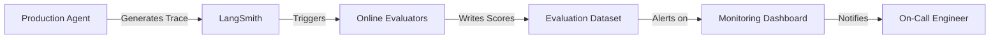

## Overview

Online evaluation monitors production agents in real-time, automatically assessing quality, correctness, and performance without manual review. Unlike offline evaluation during development, online evals run continuously on live traffic.

## Why Online Evaluation?

Production agents face scenarios you can't anticipate during development:

- **Distribution Shift**: User queries differ from test data
- **Edge Cases**: Rare inputs that expose weaknesses
- **Performance Degradation**: Model updates or API changes affecting quality
- **Cost Monitoring**: Tracking token usage and latency at scale

<Warning>
Without online evaluation, production issues may go undetected for days or weeks, degrading user experience and trust.
</Warning>

## Evaluation Architecture



## Setting Up Online Evaluators

### 1. Define Evaluation Metrics

Identify what to measure based on your use case:

```python
from langsmith import evaluate
from langsmith.schemas import Run, Example

# Correctness evaluator
def check_answer_correctness(run: Run, example: Example) -> dict:
    """Evaluate if the answer is factually correct."""
    # Use LLM-as-judge pattern
    result = llm_judge(
        question=run.inputs["question"],
        answer=run.outputs["answer"],
        reference=example.outputs.get("expected_answer")
    )
    return {
        "key": "correctness",
        "score": result.score,
        "comment": result.reasoning
    }

# Helpfulness evaluator
def check_helpfulness(run: Run, example: Example) -> dict:
    """Evaluate if response is helpful and actionable."""
    prompt = f"""
    Question: {run.inputs["question"]}
    Answer: {run.outputs["answer"]}
    
    Is this answer helpful and actionable? Rate 0-1.
    """
    score = llm_evaluator(prompt)
    return {
        "key": "helpfulness",
        "score": score
    }

# Latency evaluator
def check_latency(run: Run, example: Example) -> dict:
    """Check if response time is within SLA."""
    latency_ms = (run.end_time - run.start_time).total_seconds() * 1000
    threshold_ms = 3000  # 3 second SLA
    
    return {
        "key": "latency_sla",
        "score": 1.0 if latency_ms < threshold_ms else 0.0,
        "comment": f"{latency_ms:.0f}ms (threshold: {threshold_ms}ms)"
    }

# Policy compliance evaluator
def check_policy_compliance(run: Run, example: Example) -> dict:
    """Ensure response follows company policies."""
    answer = run.outputs["answer"]
    
    # Check for prohibited content
    prohibited_terms = ["confidential", "internal only", "not for distribution"]
    has_violation = any(term in answer.lower() for term in prohibited_terms)
    
    return {
        "key": "policy_compliance",
        "score": 0.0 if has_violation else 1.0,
        "comment": "Contains prohibited terms" if has_violation else "Compliant"
    }
```

### 2. Configure Automated Evaluation

Set up evaluators to run automatically on new traces:

```python
from langsmith import Client

client = Client()

# Create evaluation configuration
evaluation_config = {
    "evaluators": [
        check_answer_correctness,
        check_helpfulness,
        check_latency,
        check_policy_compliance
    ],
    "project_name": "prod-customer-support",
    "sampling_rate": 1.0,  # Evaluate 100% of traces
}

# Register evaluators to run on all new traces
client.register_evaluators(
    project_name=evaluation_config["project_name"],
    evaluators=evaluation_config["evaluators"],
    sampling_rate=evaluation_config["sampling_rate"]
)
```

### 3. Sampling Strategies

For high-traffic systems, evaluate a sample of traces:

```python
# Evaluate 10% of traces randomly
sampling_rate = 0.1

# Or use stratified sampling by category
def should_evaluate(run: Run) -> bool:
    category = run.extra.get("metadata", {}).get("category")
    
    # Always evaluate error cases
    if run.error:
        return True
    
    # Sample by category
    sampling_rates = {
        "inventory": 0.1,
        "policy": 0.2,  # Higher rate for critical category
        "out_of_scope": 0.05,
        "both": 0.15,
        "website_troubleshooting": 0.1
    }
    
    rate = sampling_rates.get(category, 0.1)
    return random.random() < rate
```

## Production Evaluation Patterns

### Pattern 1: Real-Time Alerts

Trigger alerts when metrics fall below thresholds:

```python
import statistics
from datetime import datetime, timedelta

def monitor_evaluation_scores(project_name: str, window_hours: int = 1):
    """Monitor recent evaluation scores and alert on degradation."""
    client = Client()
    
    # Fetch recent runs with evaluation scores
    since = datetime.utcnow() - timedelta(hours=window_hours)
    runs = client.list_runs(
        project_name=project_name,
        start_time=since,
        is_root=True
    )
    
    # Aggregate scores by metric
    scores_by_metric = {}
    for run in runs:
        for feedback in run.feedback:
            metric = feedback.key
            if metric not in scores_by_metric:
                scores_by_metric[metric] = []
            scores_by_metric[metric].append(feedback.score)
    
    # Check thresholds
    thresholds = {
        "correctness": 0.85,
        "helpfulness": 0.80,
        "latency_sla": 0.95,
        "policy_compliance": 0.99
    }
    
    alerts = []
    for metric, scores in scores_by_metric.items():
        if not scores:
            continue
            
        avg_score = statistics.mean(scores)
        threshold = thresholds.get(metric, 0.80)
        
        if avg_score < threshold:
            alerts.append({
                "metric": metric,
                "avg_score": avg_score,
                "threshold": threshold,
                "num_samples": len(scores)
            })
    
    if alerts:
        send_alert(alerts)  # Implement your alerting logic
    
    return alerts
```

### Pattern 2: Comparative Evaluation

Compare current performance against historical baseline:

```python
def compare_to_baseline(current_scores: dict, baseline_scores: dict) -> dict:
    """Detect statistically significant changes from baseline."""
    from scipy import stats
    
    results = {}
    for metric in current_scores.keys():
        if metric not in baseline_scores:
            continue
        
        # Perform t-test
        t_stat, p_value = stats.ttest_ind(
            current_scores[metric],
            baseline_scores[metric]
        )
        
        current_mean = statistics.mean(current_scores[metric])
        baseline_mean = statistics.mean(baseline_scores[metric])
        
        results[metric] = {
            "current_mean": current_mean,
            "baseline_mean": baseline_mean,
            "change_pct": ((current_mean - baseline_mean) / baseline_mean) * 100,
            "p_value": p_value,
            "significant": p_value < 0.05
        }
    
    return results
```

### Pattern 3: Category-Based Evaluation

Evaluate differently based on query category:

```python
def evaluate_by_category(run: Run, example: Example) -> list[dict]:
    """Apply category-specific evaluators."""
    category = run.extra.get("metadata", {}).get("category")
    
    # Base evaluators for all categories
    results = [
        check_latency(run, example),
        check_policy_compliance(run, example)
    ]
    
    # Category-specific evaluators
    if category == "inventory":
        results.append(check_product_mention(run, example))
        results.append(check_stock_accuracy(run, example))
    elif category == "policy":
        results.append(check_policy_citation(run, example))
        results.append(check_contact_info(run, example))
    elif category == "out_of_scope":
        results.append(check_proper_deflection(run, example))
    
    return results
```

### Pattern 4: Human-in-the-Loop Validation

Flag uncertain cases for human review:

```python
def requires_human_review(run: Run, eval_scores: dict) -> bool:
    """Determine if trace needs human validation."""
    # Review if any score is borderline
    borderline_threshold = 0.1
    for score in eval_scores.values():
        if 0.4 < score < 0.6:  # Uncertain score
            return True
    
    # Review if error occurred
    if run.error:
        return True
    
    # Review if user query is particularly complex
    query_length = len(run.inputs.get("question", ""))
    if query_length > 500:  # Long, complex query
        return True
    
    return False

# Queue for human review
if requires_human_review(run, eval_scores):
    client.create_annotation(
        run_id=run.id,
        key="needs_review",
        value=True,
        comment="Flagged for human validation"
    )
```

## Cost and Performance Monitoring

### Tracking Token Usage

```python
def track_token_costs(run: Run, example: Example) -> dict:
    """Calculate and log token costs."""
    # Extract token counts from run metadata
    total_tokens = 0
    for child_run in run.child_runs:
        if child_run.run_type == "llm":
            usage = child_run.outputs.get("usage", {})
            total_tokens += usage.get("total_tokens", 0)
    
    # Calculate cost (example: GPT-4 pricing)
    cost_per_1k_tokens = 0.03  # $0.03 per 1K tokens
    total_cost = (total_tokens / 1000) * cost_per_1k_tokens
    
    return {
        "key": "token_cost",
        "score": total_tokens,
        "comment": f"${total_cost:.4f} ({total_tokens} tokens)"
    }
```

### Monitoring Response Quality Over Time

```python
import pandas as pd
import matplotlib.pyplot as plt

def plot_quality_trends(project_name: str, days: int = 7):
    """Visualize evaluation metrics over time."""
    client = Client()
    
    since = datetime.utcnow() - timedelta(days=days)
    runs = client.list_runs(project_name=project_name, start_time=since)
    
    data = []
    for run in runs:
        for feedback in run.feedback:
            data.append({
                "timestamp": run.start_time,
                "metric": feedback.key,
                "score": feedback.score
            })
    
    df = pd.DataFrame(data)
    
    # Plot trends by metric
    for metric in df["metric"].unique():
        metric_df = df[df["metric"] == metric]
        metric_df = metric_df.set_index("timestamp").resample("1H").mean()
        
        plt.figure(figsize=(12, 6))
        plt.plot(metric_df.index, metric_df["score"])
        plt.title(f"{metric.title()} Over Time")
        plt.xlabel("Time")
        plt.ylabel("Score")
        plt.grid(True)
        plt.savefig(f"{metric}_trend.png")
```

## Evaluation Best Practices

<Steps>
  <Step title="Start with Simple Metrics">
    Begin with basic evaluators (latency, error rate, output length) before implementing complex LLM-based judges.
  </Step>

  <Step title="Calibrate Thresholds">
    Use historical data to set realistic thresholds. Avoid alert fatigue from overly strict limits.
  </Step>

  <Step title="Combine Automated and Human Review">
    Use automated evals to filter, but maintain human review for borderline cases and continuous calibration.
  </Step>

  <Step title="Monitor Evaluator Performance">
    Regularly validate that your evaluators are working correctly. Track disagreement rates with human judgments.
  </Step>

  <Step title="Version Your Evaluators">
    Track changes to evaluation logic. When you update an evaluator, compare results against the previous version.
  </Step>
</Steps>

## Common Pitfalls

<Warning>
**Evaluator Drift**: LLM-based evaluators can drift over time as models are updated. Periodically re-validate against ground truth.
</Warning>

<Warning>
**Sampling Bias**: If you only evaluate successful traces, you'll miss failure modes. Ensure error cases are included.
</Warning>

<Warning>
**Alert Fatigue**: Too many alerts reduce effectiveness. Start with high-severity metrics and gradually add more.
</Warning>

## Integration with Deployment

### Pre-Deployment Validation

Before rolling out new agent versions:

```python
def validate_before_deployment(candidate_project: str, baseline_project: str):
    """Compare candidate version against baseline."""
    client = Client()
    
    # Run evaluations on both projects
    candidate_scores = get_evaluation_scores(candidate_project)
    baseline_scores = get_evaluation_scores(baseline_project)
    
    # Compare metrics
    comparison = compare_to_baseline(candidate_scores, baseline_scores)
    
    # Decision logic
    for metric, result in comparison.items():
        if result["significant"] and result["change_pct"] < -5:
            print(f"❌ Deployment blocked: {metric} degraded by {result['change_pct']:.1f}%")
            return False
    
    print("✅ All metrics pass. Safe to deploy.")
    return True
```

### Continuous Deployment Pipeline

```bash
#!/bin/bash
# deploy-agent.sh

set -e

# Deploy to staging
echo "Deploying to staging..."
deploy_to_staging

# Run online evals on staging traffic
echo "Running evaluations..."
python run_online_evals.py --project staging-agent --duration 1h

# Check if metrics meet thresholds
if python validate_metrics.py --project staging-agent; then
    echo "✅ Metrics validated. Deploying to production..."
    deploy_to_production
else
    echo "❌ Metrics below threshold. Deployment aborted."
    exit 1
fi
```

## Next Steps

<CardGroup cols={2}>
  <Card title="Production Overview" icon="rocket" href="/production/overview">
    Review complete production deployment strategies
  </Card>
  <Card title="Trace Upload" icon="upload" href="/production/trace-upload">
    Learn how to upload traces for evaluation
  </Card>
</CardGroup>